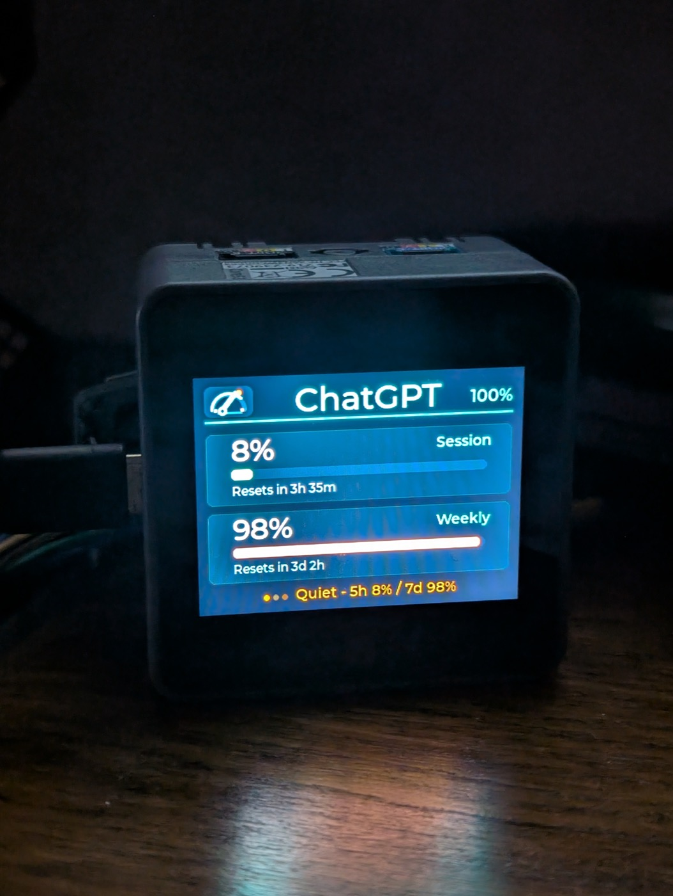
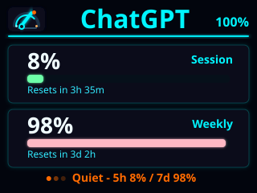
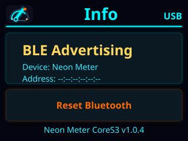

# Neon Meter

PlatformIO Arduino firmware for the M5Stack CoreS3 ESP32-S3 IoT Development
Kit. It shows provider-neutral AI usage data in a neon-styled LVGL dashboard inspired by
Clawdmeter, with support for Claude-compatible payloads plus ChatGPT/Codex
provider labels.

Credentials stay off the device: the required
[Neon Meter Host](https://github.com/SunboX/neon-meter-host) companion app
fetches usage data and sends compact JSON over USB serial or BLE.

## Easy Install with ESP Web Tools

The easiest way to flash Neon Meter is the
[ESP Web Tools installer](https://sunbox.github.io/neon-meter/). Open it in
Chrome or Edge, connect the M5Stack CoreS3 over USB, then click
**Install Neon Meter** and approve the Web Serial prompts.

Most users do not need PlatformIO or a local firmware build.

Routine updates use split firmware images so the device's NVS-backed BLE
identity and pairing state are preserved. A merged factory image remains
available separately for explicit full-erase recovery.

## Device Photo

  

## Rendered Screenshots

  
  

## Documentation

- [Development workflow](docs/development.md)
- [USB/BLE protocol and payload format](docs/protocol.md)
- [Firmware implementation spec](specs/neon-meter-firmware.md)
- [Changelog](CHANGELOG.md)

For host compatibility details and provider payload examples, see
[docs/protocol.md](docs/protocol.md).

## License

Firmware and tooling are licensed under AGPL-3.0-or-later. Documentation and
project notices are licensed under CC-BY-SA-4.0. A separate
commercial/proprietary license may be available from the copyright holder.

See [LICENSE](LICENSE), [COMMERCIAL-LICENSE.md](COMMERCIAL-LICENSE.md),
[NOTICE.md](NOTICE.md), and the [LICENSES](LICENSES) directory.
